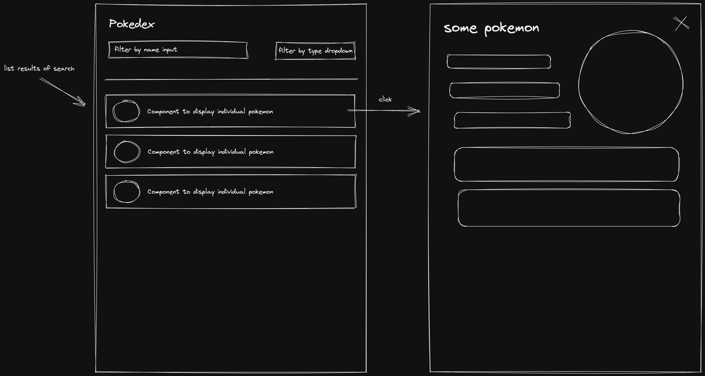

# Nuant FE Test

This project uses vite react-ts template which provides a minimal setup to get React working in Vite with ESLint rules.

It's been configured with Tailwindcss in case you want to use it Pokenode to retrieve the data of Pokemons

- [Pokenode](https://pokenode-ts.vercel.app/) (hint for the pokenode usage, PokemonClient has very helpful functions like `listPokemons`, `listTypes`, `getPokemonById` and `getPokemonByName` and many options more!) 
- [Tailwind](https://tailwindcss.com/)

The purpose of the test is to implement an app that have the ability of :

- Search for Pokemon by `name` and the posibility to filter the results by `type`
  (User can search by name, user can filter pokemons by type, user can do both at the same time also)
- Display the search results with enough detail to be able to identify to which Pokemon each result belongs.(Name and a image would do)
- View more information about the Pokemon on a dedicated page by clicking a search result. (You can display Name, different sprites, weight, height and basic information, dealing with linked entities will be bonus point but arent really mandatory).
- See the previous search results when navigating back to the search page from the pokemon details page.

So basically something like:

-Tool and Library Selection: You're encouraged to leverage any libraries, frameworks, or tools that you believe will streamline the development process and enhance the quality of the final product. Whether it's a front-end framework like React.js or a design tool like Figma, choose what aligns best with your skillset and the project requirements.

-Approach to Task: Treat this technical test as you would a real-world project. Break down the task into manageable components, define clear objectives, and follow best practices for code organization, documentation, and testing. Your approach should reflect your ability to deliver high-quality work within a given timeframe.

-Commit Log: Provide a detailed commit log that outlines your thought process, decisions, and implementation steps throughout the project. This allows reviewers to understand how you approached the task, the challenges you encountered, and how you resolved them. It also demonstrates your ability to work collaboratively and communicate effectively within a team setting.

-Long-Term Perspective: Consider this task as part of a larger project with potential for future iterations and enhancements. Your implementation should be flexible, scalable, and well-structured to accommodate additional functionalities or changes down the line. Think about how your codebase can be easily maintained and extended by other developers in the future.
Overall, approach the task with professionalism, attention to detail, and a focus on delivering a high-quality solution that meets the project requirements and demonstrates your technical skills and expertise.

 ### Submitting

  To submit your finished project, share with us a link to a GitHub repository containing its code. Along with instructions on how to run the app, include answers to the following:

- What part of building the project was the most difficult? Why?
- How long did it take to have this test completed ? Which part of the test took you longer? Could you specify roughly the amount of time it took you to do the following:
    - Set up environment    
    - Search feature
    - Filter feature
    - Result display
    - Other (please specify)

